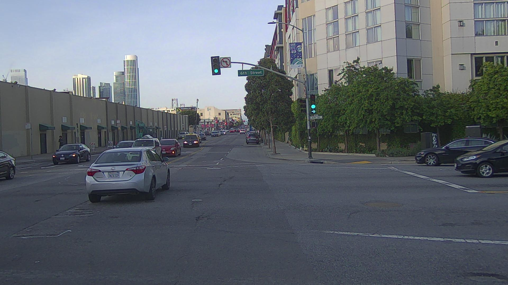
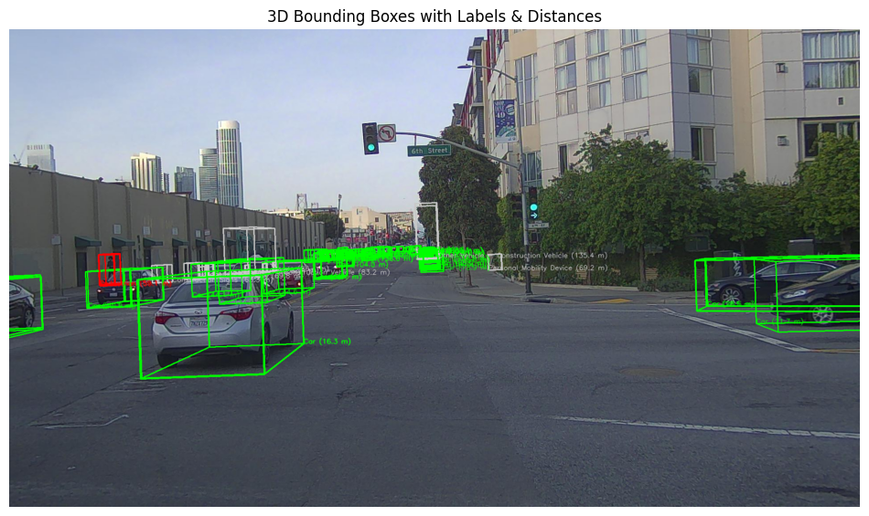

## Projection of 3D Bounding Boxes onto 2D Image Plane
In this project, we visualize annotated 3D object bounding boxes by projecting them from world coordinates onto a 2D camera image. This is a crucial step in perception systems for autonomous driving, enabling visual understanding of object localization in real-world scenes.

We aim to project 3D bounding boxes of various objects onto the image plane using the camera's intrinsic and extrinsic parameters.

The translation vector of the camera with respect to the world coordinate system is:

t = [0.4089, 0.2613, 1.8091]

The rotation is represented as a quaternion:

q = [w, x, y, z] = [0.65782, −0.64741, 0.28335, −0.2604]

The code first converts the quaternion and translation into a full 4×4 extrinsic transformation matrix, representing the camera pose in the world frame.

## Files Used
intrinsics.json: Contains the intrinsic parameters of the camera (focal lengths, principal point, image size).

bbox.pkl.gz: A compressed pickle file containing a pandas.DataFrame of all annotated 3D bounding boxes. Each entry includes:

position.[x, y, z]: Object center in global coordinates

dimensions.[x, y, z]: Object size (width, height, length)

yaw: Rotation angle around the z-axis in radians

label: Object class (e.g., Car, Pedestrian, etc.)

## Code Functionality
1. Loading Parameters
The code loads camera intrinsics and extrinsics, and reads the 3D bounding boxes from the pickle file.

2. Transformation and Projection
Using the extrinsic matrix, 3D bounding box corners are transformed from world coordinates into the camera frame. Then, using the intrinsic matrix, they are projected into 2D image coordinates.

3. Visualization
Projected boxes are drawn on the input image using color codes based on the object class. Labels and estimated distances (from the camera to each object center) are also rendered for clarity.

4. Execution
To run the script and generate the visualization, use the following command in your notebook or script:

Make sure the image file and required .json and .pkl.gz files are located in the correct relative paths inside your project directory.

## Note:
This project does not include object detection. It assumes that the 3D bounding boxes are already extracted and their coordinates are available as input.

